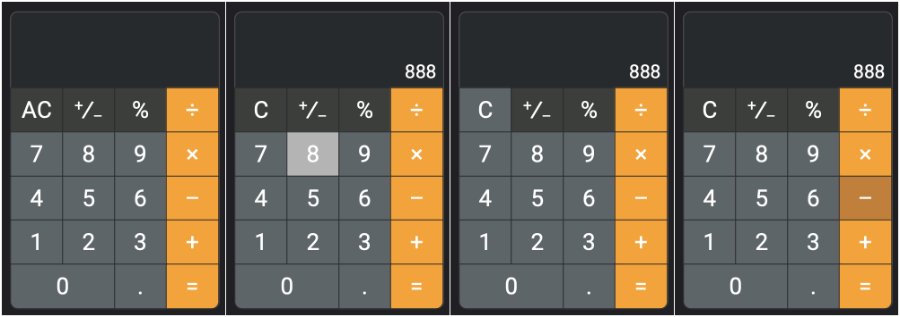
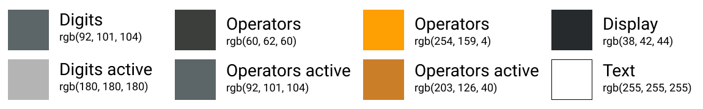
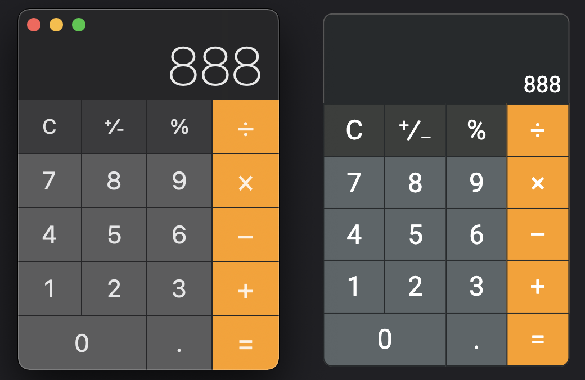

# React Calculator

## Live Site
https://calculator-arturaronov.vercel.app/

## Table of Content
1. [Stack](#stack)
2. [Snapshots](#snapshots)   
3. [Color Schemes](#color-schemes)   
4. [Inspiration](#inspiration)    
5. [Useful Links](#useful-links)   
6. [Function & Variables Explanations](#function-&-variable-explanations)   

### Stack
- React
- Vanilla CSS

### Snaphosts
   


### Color Schemes   
    


### Inspiration
    


### Useful Links
[Converting string into mathematical operator - Stack Overflow](https://stackoverflow.com/questions/13077923/how-can-i-convert-a-string-into-a-math-operator-in-javascript)


### Function & Variables Explanations
### Functions design notes
User input is stored in two different arrays - ``firstBuffer`` for initial input and ``secondBuffer`` array when operators (such as +, -, %, x) gets pressed. The initial values pressed by user get stored in ``firstBuffer``. Once user presses one of the operator buttons, the new value values get stored in the ``secondBuffer``array.

- This variable stores ``true`` or ``false`` depending if ``firstBuffer`` is empty or not.
    ```
    let verifyFirstBuffer=firstBuffer.length<1;
    ```

- This variable stores ``true`` or ``false`` depending if ``secondBuffer`` is empty or not.
    ```
    let verifySecondBuffer=secondBuffer.length<1;
    ```

- This variable stores ``true`` or ``false`` depending whether the operator button has been pressed or not.
    ```
    let verifyOperator=operator===null;
    ```

- Below method will store functions used for calculations in the calculator.
    ```
    const math={
      '+': function(x,y){return x+y},
      '-': function(x,y){return x-y},
      '*': function(x,y){return x*y},
      '/': function(x,y){return x/y},
    };
    ```

- ``allocateDigits`` function contains 2 if/else statements. First statement verifies that ``secondBuffer`` array is empty and none of the operator has been clicked on. If both of them result to true, then the input get added into the ``firstBuffer``. The second statement (``else if``) verifies if operator has been clicked, if that results to true, then the input gets added into the ``secondBuffer``.
    ```
    function allocateDigits(input){
      if(verifySecondBuffer&&verifyOperator) {
        setFirstBuffer([...firstBuffer, input])
      } else if(!verifyOperator) {
        setSecondBuffer([...secondBuffer, input])
      };
    };
    ```

- ``operatorLogic`` function gets activated every time user presses one of the operator buttons (+, -, /, 
\*). First thing it does is checks whether the ``input`` is a nevative number, if true it will allocate a minus sign ( - ) in front of that integer (be that in the ``firstBuffer`` or ``secondBuffer``. Should there be no negative numbers then the operator gets allocated with ``setOperator``.
    ```
    function operatorLogic(input) {
      if(input==='negPos'&&verifySecondBuffer) {
        Number(firstBuffer.join(''))>0?setFirstBuffer(['-', ...firstBuffer]):setFirstBuffer([firstBuffer.slice(1, firstBuffer.length).join('')]);
      } else if(input==='negPos'&&!verifyOperator) {
        Number(secondBuffer.join(''))>0?setSecondBuffer(['-', ...secondBuffer]):setSecondBuffer([secondBuffer.slice(1, secondBuffer.length).join('')]);
      } else if(operator!=='negPos') {
        setOperator(input);
      };
    };
    ```

- ``result`` function gets called whenever the **=** button gets pressed. From there it takes both values from ``firstBuffer`` and ``secondBuffer`` and runs computation from the ``math`` method. The result of that computation gets stored in ``firstBuffer`` and valus of ``secondBuffer`` and ``operator`` get reset to the original empty values.
    ```
    function result(){
      if(operator==='+') {
        setFirstBuffer([math['+'](Number(firstBuffer.join('')), Number(secondBuffer.join('')))]);
        setSecondBuffer([]);
        setOperator(null)
      } else if(operator==='-') {
        setFirstBuffer([math['-'](Number(firstBuffer.join('')), Number(secondBuffer.join('')))]);
        setSecondBuffer([]);
        setOperator(null);
      } else if(operator==='*') {
        setFirstBuffer([math['*'](Number(firstBuffer.join('')), Number(secondBuffer.join('')))]);
        setSecondBuffer([]);
        setOperator(null);
      } else if(operator==='/') {
        setFirstBuffer([math['/'](Number(firstBuffer.join('')), Number(secondBuffer.join('')))]);
        setSecondBuffer([]);
        setOperator(null);
      };
    };
    ```

- ``percentage`` function gets called whenever the **%** button gets pressed. It first checks if ``firstBuffer`` is empty/false, in which case it will return nothing but the empty array. Should the ``firstBuffer`` not be empty, the value will be divided by 100 depending whether the current number is located in the ``firstBuffer`` or the ``secondBuffer``.
    ```
    function percentage(){
      if(verifyFirstBuffer) {
        return firstBuffer
      } else { 
        return verifySecondBuffer?setFirstBuffer([parseFloat(firstBuffer.join(''))/100]):setSecondBuffer([parseFloat(secondBuffer.join(''))/100])
      };
    };
    ```

- It is what it says on the label. Resets all of the values to the original states whenever the **C**/**AC** button gets pressed.
    ```
    function reset(){
      setFirstBuffer([]);
      setSecondBuffer([]);
      setOperator(null);
    };
    ```

- ``showNumber`` function controls which number gets shown on display between ``firstBuffer`` or ``secondBuffer`` by verifying whether the ``secondBuffer`` is empty. If true, then value in the ``firstBuffer`` is displayed, if false, the ``secondBuffer`` is displayed.
    ```
    function showNumber(){
      return secondBuffer.length>0?secondBuffer:firstBuffer
    };
   ```
